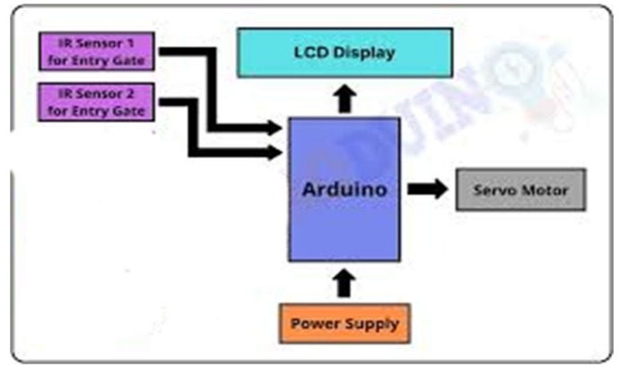
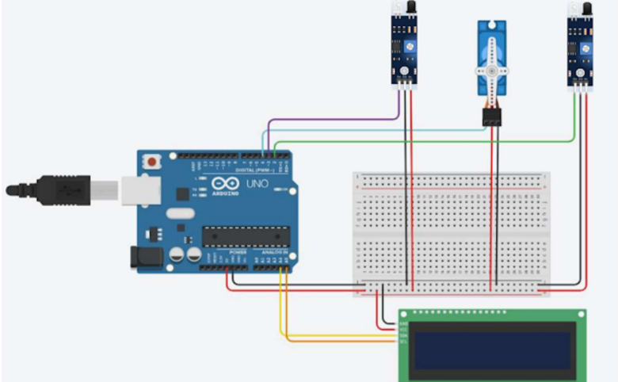
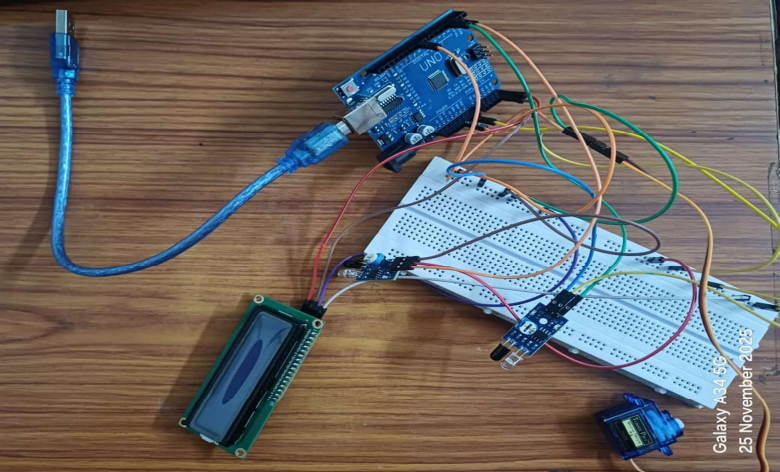
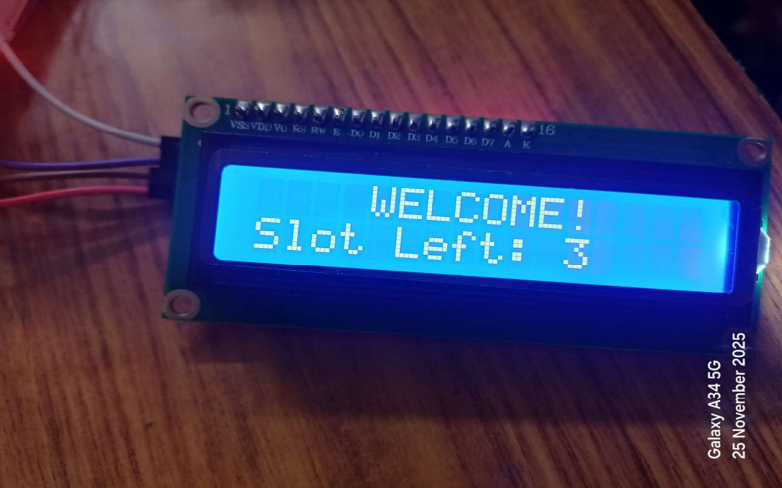
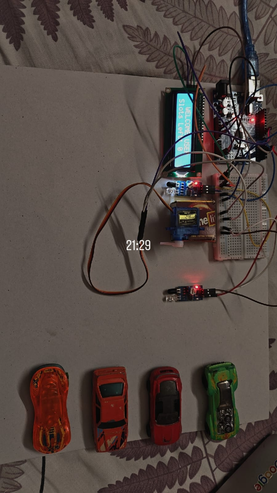

# 🚗 Intelligent Urban Parking Space Optimization

An Arduino-based Smart Parking System that automates vehicle entry and exit while displaying real-time parking slot availability using IR sensors, a servo motor, and a 16×2 I2C LCD.

---

## 📌 Overview

Urban parking has become a major challenge due to the increasing number of vehicles and limited parking spaces. This project presents a low-cost embedded solution that automates parking management by detecting vehicle movement at the entry and exit points, updating the available parking slot count, and controlling an automatic gate.

The system is designed using Arduino Uno and demonstrates real-time sensing, automation, and embedded system programming.

---

## ✨ Features

- 🚗 Automatic vehicle detection
- 📊 Real-time parking slot monitoring
- 🚦 Automated gate control using Servo Motor
- 📺 Live parking status on LCD Display
- ⚡ Low-cost embedded solution
- 🔧 Easy to expand into an IoT-based smart parking system

---

## 🛠 Hardware Components

| Component | Purpose |
|-----------|----------|
| Arduino Uno | Main controller |
| IR Sensor ×2 | Vehicle entry & exit detection |
| Servo Motor (SG90) | Automatic gate control |
| 16×2 LCD with I2C | Displays available slots |
| Breadboard | Circuit connections |
| Jumper Wires | Hardware interfacing |
| USB Power Supply | Power source |

---

## 💻 Software Used

- Arduino IDE
- Embedded C (Arduino Programming)

### Libraries

- Servo.h
- Wire.h
- LiquidCrystal_I2C.h

---

# 🏗 System Architecture

---

# ⚙ Circuit Diagram

---

# 📸 Project Images

## Hardware Setup

---

## LCD Output

---

## Working Model

---

# 🔄 Working Principle

1. Vehicle approaches the entry gate.
2. Entry IR sensor detects the vehicle.
3. Arduino checks the available parking slots.
4. If slots are available:
   - Servo motor opens the gate.
   - Slot count decreases.
5. If parking is full:
   - Gate remains closed.
   - LCD displays **Parking Full**.
6. Exit IR sensor detects departing vehicles.
7. Arduino updates the slot count.
8. LCD displays the updated parking availability.

---

# 🚀 Applications

- Smart City Parking
- Shopping Malls
- Office Buildings
- Residential Apartments
- College Campuses
- Hospitals
- Public Parking Areas

---

# 📈 Future Enhancements

- IoT Integration using ESP32/ESP8266
- Mobile Application
- RFID-based Vehicle Authentication
- Cloud Monitoring Dashboard
- Online Slot Reservation
- Automatic Payment System
- Camera-based Vehicle Detection

---

# 📊 Results

The developed prototype successfully:

- Detected vehicles using IR sensors.
- Updated parking slot availability in real time.
- Controlled the entry gate automatically.
- Displayed parking status on the LCD.
- Demonstrated reliable operation using low-cost hardware.

---

# 📖 Documentation

A detailed report containing:

- Literature Review
- System Design
- Circuit Diagram
- Arduino Code
- Flowchart
- Results
- Future Scope

can be found here:

📄 **Project_Report.pdf**

---

# 👨‍💻 Author

**Sarthak Gupta**

B.Tech Electronics & Communication Engineering

Jaypee Institute of Information Technology (JIIT), Noida

LinkedIn: *www.linkedin.com/in/sarthakgupta2901*

---

